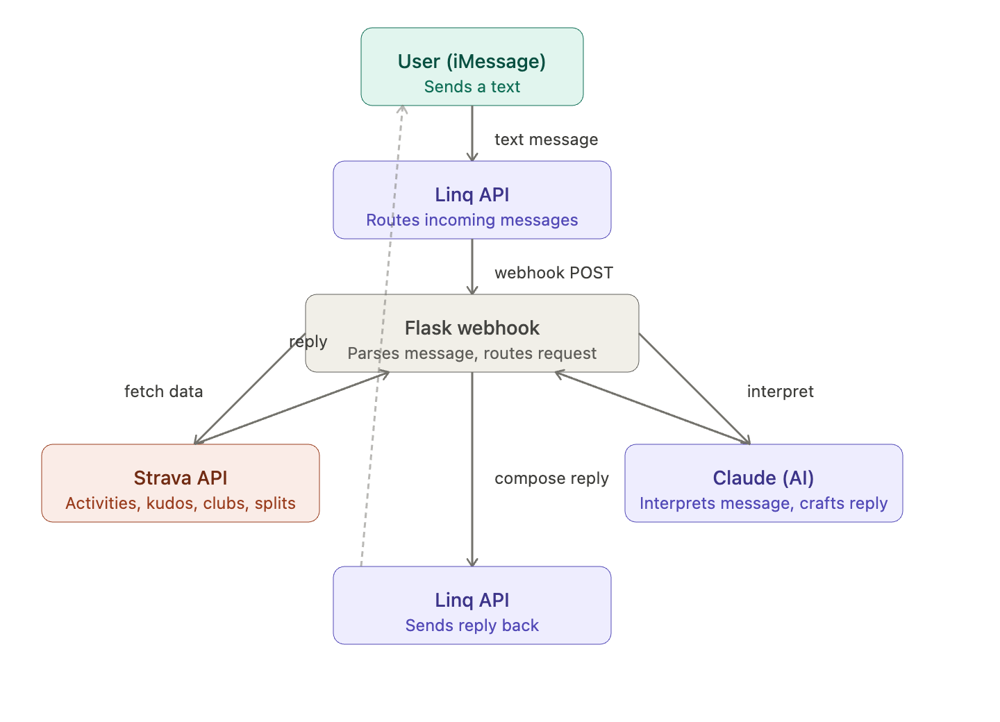

# Introduction 


Are we all in our running era nowadays? Before Strava, did a run even happen? No Garmin trace, no segment, no kudos , just you, the road, and absolutely no proof. We're obsessed with the numbers such as our pace, our splits, our weekly mileage and even more obsessed with making sure everyone else sees them too." No more awkward Facebook meetups, no more scattered fitness apps. We don't just run for our cardiovascular health anymore; we run for the kudos, the segments, and the community.


<table>
  <tr>
    <td></td>
    <td>
      
      <br/>
      <em>Examples of funny activities from Strava</em>
    </td>
  </tr>
</table>

<figure align="center">
  
  <figcaption><em>Sydney Marathon 2025</em></figcaption>
</figure>

# Ride or Stride 
I built a product called **Ride or Stride** — an AI running buddy and motivation peer that brings your Strava stats straight to iMessage. Instead of opening the app, you can text to retrieve your running stats recorded in Strava and even draft quick posts to your account to rack up those kudos.

Here's an example of what it can do:


<table>
  <tr>
    <td></td>
        <td></td>

  </tr>
</table>


#### Use Cases
- **"What were my last run stats?"** — Get a quick breakdown of your most recent activity: distance, pace, time, and elevation.
- **"Who gave me kudos?"** — See who reacted to your latest effort without opening the app.
- **"What clubs am I in?"** — Pull up your Strava clubs and recent club activity.
- **"Give me details on my marathon."** — Get splits, heart rate zones, and race highlights for any activity.
- **"Write a post for my morning run."** — Let Claude draft a shareable Strava caption based on your stats.
- **"Motivate me for today's long run."** — Get a personalized pep talk before you head out.


The goal is to make Strava feel more conversational and social. Instead of digging through the app, you can text things the above sayings to get info on demand!

## How It Works

Ride or Stride connects the Strava API to the Linq API, letting you text your Linq number and ask for run stats, kudos, clubs, race details, motivation, or a ready-to-share post caption.



### Flow 
- You send a text to your Linq number from iMessage
- The app receives your message through a Flask webhook
- It calls the Strava API to grab your activity data
- Claude AI reads your message and turns your stats into a conversational reply
- It can also generate shareable captions for your Strava posts
- If AI is unavailable, it falls back to a manual reply
- Your reply gets sent back to you through the Linq API


### API Docs
- **Linq:** https://docs.linqapp.com/
- **Strava:** https://developers.strava.com/docs/reference/ 
- **Claude:** https://platform.claude.com/docs/en/home 

## Project Files
``` text
Ride-or-Stride/
├── src/
│   ├── __init__.py
│   ├── app.py              # Flask webhook + Linq message replies
│   ├── ai_agent.py         # Claude/Gemini AI response layer
│   ├── strava_auth.py      # Strava token refresh + API access helpers
│   └── strava_stats.py     # Strava stats, kudos, clubs, splits, captions
├── tests/
│   ├── __init__.py
│   ├── list_claude_models.py
│   ├── verify_linq_setup.py
│   ├── verify_strava_setup.py
│   ├── test_claude.py
│   ├── test_gemini.py
│   └── test_strava_use_cases.py
├── media/
│   └── IMG_6984.PNG        # Public/shareable image asset
├── .env                    # Local secrets, not committed
├── .env.example            # Template for required environment variables
├── .gitignore
├── README.md
└── requirements.txt
```

## Setup

### 1. Install dependencies

From the project folder, run:

```bash
pip install -r requirements.txt
```

### 2. Create your `.env` file

Create a file named `.env` in the project folder:

```bash
cp .env.example .env
```
Fill in the required values in `.env`. Keep `.env` private because it contains secrets.

`LINQ_API_KEY` is the API token used to authenticate requests to the Linq API.

`LINQ_FROM_NUMBER` is your Linq phone number. This is the number the bot sends replies from, and it should be written in E.164 format, like `+12055550123`.

`LINQ_TEST_TO_NUMBER` is a personal test phone number used by `tests/verify_linq_setup.py` when you want to test sending a Linq message manually without waiting for a webhook.

For Strava, the long-term setup is `STRAVA_CLIENT_ID`, `STRAVA_CLIENT_SECRET`, and `STRAVA_REFRESH_TOKEN`. The app uses those to refresh `STRAVA_TOKEN` automatically because Strava access tokens expire.

`DEFAULT_POST_IMAGE_URL` is optional. If Strava does not provide a photo for an activity, the bot can use this public HTTPS image URL when you ask it to set up a post. Linq direct URL attachments must be public HTTPS files.

`AI_PROVIDER` can be `claude` or `gemini`. If the selected provider is missing a key or the AI request fails, the app still replies with a manual Strava summary.

## How The AI Agent Works

The project keeps each responsibility in a separate file:

```text
phone text -> Linq webhook -> src/app.py -> src/strava_stats.py -> src/ai_agent.py -> Linq reply
```

- `src/app.py` receives the Linq webhook and decides what to do with the message.
- `src/strava_auth.py` handles Strava token refresh and authenticated API requests.
- `src/strava_stats.py` gets structured stats for your Strava activities.
- `src/ai_agent.py` sends those stats and the user's message to Claude or Gemini, then returns a text-message-friendly response.

For example, instead of only returning:

```text
Last run: 3.23 mi in 32.1 min
```

the AI agent can reply with something more natural:

```text
Nice run. You covered 3.2 mi in 32.1 min, around 9.94 min/mi. Looks like a steady aerobic effort.
```

If the AI agent is not connected, the app falls back to manual Strava-based replies using the stats returned from `src/strava_stats.py`.

## Running the Webhook

Start the Flask app:

```bash
python src/app.py
```

By default, the app runs locally at:

```text
http://127.0.0.1:5000
```

The Linq webhook endpoint is:

```text
/webhook
```

So the full local URL is:

```text
http://127.0.0.1:5000/webhook
```

## Exposing the Webhook

Linq needs a public URL to send webhook events to your local Flask app. For local development, you can use a tunneling tool like ngrok:

```bash
ngrok http 5000
```

Ngrok will give you a public URL. Use that URL plus `/webhook` in your Linq webhook settings:

```text
https://your-ngrok-url.ngrok-free.app/webhook
```

## Testing a Linq Message

To test sending a message through the Linq API:

```bash
python tests/verify_linq_setup.py
```

This uses:

- `LINQ_API_KEY`
- `LINQ_FROM_NUMBER`
- `LINQ_TEST_TO_NUMBER`

from your `.env` file.

## Testing Strava Only

To test whether your Strava token works:

```bash
python tests/verify_strava_setup.py
```

If the token is valid, it should print your latest run stats.

If `STRAVA_CLIENT_ID`, `STRAVA_CLIENT_SECRET`, and `STRAVA_REFRESH_TOKEN` are set, this command refreshes the Strava access token automatically and writes the newest `STRAVA_TOKEN` and `STRAVA_REFRESH_TOKEN` back into `.env`.

## Testing The AI Agent Only

The AI agent is used automatically when you text the Linq number and the selected provider key is set in `.env`.

If the AI key is missing, `src/ai_agent.py` falls back to the manual Strava summary so the project can still run without AI.

To test Claude without sending a Linq text:

```bash
python tests/test_claude.py
```

If Claude is connected, the terminal should show `AI AGENT: using Claude model ...` and `AI AGENT REPLY: ...`.

To test Gemini without sending a Linq text:

```bash
python tests/test_gemini.py
```

If Gemini is connected, the terminal should show `AI AGENT: using Gemini model ...` and `AI AGENT REPLY: ...`.

## How To Use It From Your Phone

Once the Flask app is running and your Linq webhook is configured, send a message like this to your Linq number:

```text
last run
```

The app should reply with your latest Strava run distance and moving time.

Other useful texts:

```text
set up a post for my last run
last run stats
last run kudos
who gave me kudos?
my clubs
Nov 22 half marathon splits
```

## Notes

- Do not commit `.env`.
- If your Strava token expires, you will need to generate or refresh it.
- If Linq cannot reach your webhook, make sure your Flask app and ngrok tunnel are both running.
